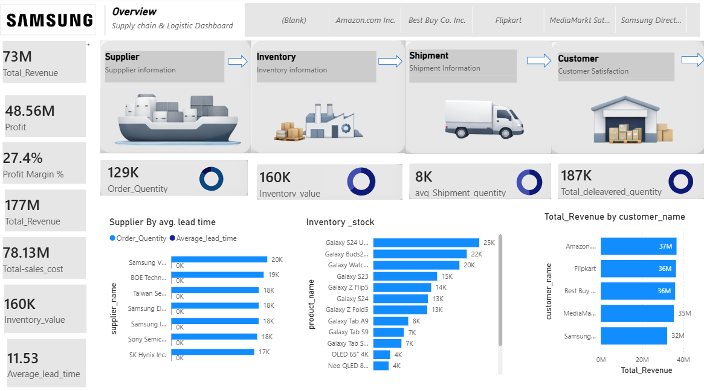

# 🏭 Samsung Supply Chain & Logistics Dashboard — Power BI

## 📌 Project Overview
An interactive multi-page Power BI dashboard analyzing Samsung's 
Supply Chain and Logistics operations — covering Supplier, 
Inventory, Shipment, and Customer Satisfaction across major 
retail platforms including Amazon, Flipkart, Best Buy, 
MediaMarkt, and Samsung Direct.

## 🔢 Key Metrics
- 💰 Total Revenue: $73M
- 📈 Profit: $48.56M
- 📊 Profit Margin: 27.4%
- 📦 Order Quantity: 129K
- 🏪 Inventory Value: $160K
- 🚚 Avg Shipment Quantity: 8K
- 📬 Total Delivered Quantity: 187K
- ⏱️ Average Lead Time: 11.53 days

## 💡 Key Insights
- 🏆 **Top Customer:** Amazon leads with $37M revenue, 
  followed by Flipkart ($36M) and Best Buy ($36M)
- 📦 **Top Product:** Galaxy S24 Ultra has highest 
  inventory stock (25K units)
- 🏭 **Top Supplier:** Samsung V. leads in order 
  quantity (20K) among all suppliers
- ⏳ **Lead Time:** Average lead time of 11.53 days 
  across all suppliers
- 💹 **Strong Profitability:** 27.4% profit margin 
  indicates healthy supply chain efficiency
- 🔄 **Supply Chain Flow:** Dashboard covers complete 
  flow from Supplier → Inventory → Shipment → Customer

## 📊 Dashboard Pages
- Overview (Supply Chain Summary)
- Supplier Information
- Inventory Information
- Shipment Information
- Customer Satisfaction

## 🛠 Tools Used
- Power BI Desktop
- Microsoft Excel

## 📊 Dashboard Preview

